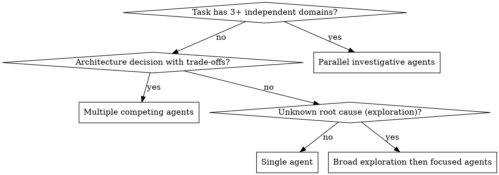

# Orchestrating Multi-Agent Work

## Overview

**You are the orchestrator.** Your job is to analyze tasks, develop strategy, and spawn specialized subagents to work in parallel.

**Core principle:** Complex tasks with independent domains deserve multiple agents working concurrently. Match orchestration strategy to task type and complexity.

## When to Use Multi-Agent Orchestration



**Use multi-agent when:**
- 3+ independent problem domains (performance, database, caching, API, etc.)
- Architecture decision with competing approaches (Redis vs in-memory vs Firestore)
- Exploratory investigation (bug with unknown cause, broad system analysis)
- Task complexity justifies 10+ subagent tool calls total

**Don't use multi-agent when:**
- Single focused problem
- Sequential dependencies (step B needs step A's output)
- Simple query or straightforward implementation

## Scale Effort Based on Complexity

**Before starting, assess complexity:**

| Task Complexity | Agent Count | Tool Calls | Example |
|----------------|-------------|------------|---------|
| **Simple** | 1 agent | 3-10 calls | "Check if feature X exists" |
| **Medium** | 2-4 agents | 10-15 calls each | "Compare two approaches" |
| **Complex** | 5-10+ agents | 10-20 calls each | "Optimize system with 7 issues" |

**Ask yourself:** "How much effort does this task deserve?"

## Collaboration Modes

Choose the right interaction mode for your task:

### Cooperation (Parallel Investigation)
**When:** Independent domains that don't conflict
**Pattern:** Spawn N agents, each investigates one domain, synthesize findings
**Example:** Performance optimization with separate database, caching, LLM, memory issues

### Competition (Multiple Approaches)
**When:** Architecture decisions, trade-off analysis, "which approach is best?"
**Pattern:** Spawn N agents, each advocates for different solution, compare results
**Example:** Caching architecture (Redis vs in-memory vs Firestore) - spawn 3 competing agents

### Coopetition (Hybrid)
**When:** Shared goal but competing on solution quality
**Pattern:** Agents work on related tasks but compete on approach quality
**Example:** Multiple refactoring approaches for same code

## The Orchestration Process

### Step 1: Declare Your Strategy

**BEFORE spawning agents, state your orchestration plan:**

```markdown
I'm using multi-agent orchestration for this complex optimization task.

**Strategy:**
- **Effort level:** Complex (7 independent issues)
- **Agent count:** 4 agents in parallel
- **Collaboration mode:** Cooperation (independent domains)
- **Agents:**
  - Agent 1: Database query optimization (issues #1, #4)
  - Agent 2: LLM call efficiency (issues #2, #5)
  - Agent 3: Memory management (issues #3, #6)
  - Agent 4: Client initialization (issue #7)

Spawning agents now...
```

### Step 2: Spawn Agents with Clear Boundaries

**How to spawn agents:** Use the Task tool for general-purpose agents, or Codex MCP for specialized deep work

#### Option A: Task Tool (General-Purpose Agents)

```
Task tool with subagent_type="general-purpose":
  description: "Investigate database performance"
  prompt: |
    You are Agent 1 investigating database query performance for the Teams bot.

    Your scope:
    - Analyze queries in teams_standup_bot.py
    - Check Firestore indexes
    - Identify N+1 patterns

    Constraints:
    - Do NOT modify LLM code (Agent 2's domain)
    - Focus only on database operations

    Expected output:
    - List of performance issues found
    - Recommended optimizations with code examples
    - Estimated performance impact

    Return your findings when complete.
```

#### Option B: Codex Plugin (Specialized Deep Work)

**Use Codex for:**
- Ultra-complex planning requiring 50+ steps
- Deep trace analysis across 10+ files
- Large-scale pattern analysis
- Detailed architecture comparison

```python
from codex_delegate import delegate

result = delegate(
    prompt="""
## Context
Read /path/to/ARCHITECTURE.md for system architecture.
Read /path/to/AGENTS.md for your workflow guidance.

Current focus: Teams bot performance optimization - investigating database layer.

## Task
Analyze database query patterns across the codebase and identify performance issues.

## Scope
- Files: teams_standup_bot.py, database/*.py
- Focus: Query efficiency, N+1 patterns, indexing
- Constraints: Do NOT analyze LLM code (separate agent)

## Expected Output
1. List of performance issues with severity
2. Specific code locations (file:line)
3. Recommended fixes with code examples
4. Estimated performance impact (quantified)
""",
    cwd="/path/to/project",
    sandbox="read-only",
    timeout=600
)
```

**Parallel Codex execution (multiple Codex agents):**
```python
from codex_delegate import delegate

# Spawn 3 Codex agents in parallel for different domains
codex_db = delegate(
    prompt="[Database analysis prompt]",
    cwd="/path/to/project",
    background=True  # Non-blocking
)

codex_llm = delegate(
    prompt="[LLM efficiency prompt]",
    cwd="/path/to/project",
    background=True  # Non-blocking
)

codex_cache = delegate(
    prompt="[Caching analysis prompt]",
    cwd="/path/to/project",
    background=True  # Non-blocking
)

# Do other work while Codex agents run in parallel...

# Collect results when ready
db_findings = codex_db.wait().output
llm_findings = codex_llm.wait().output
cache_findings = codex_cache.wait().output
```

**When to use Codex vs. Task tool:**

| Criteria | Use Task Tool | Use Codex Plugin |
|----------|---------------|------------------|
| **Complexity** | Moderate investigation | Ultra-complex (50+ steps) |
| **Files** | <10 files | 10+ files |
| **Focus** | Broad exploration | Deep sustained analysis |
| **Output** | Quick findings | Detailed technical report |
| **Context needs** | Project context | Technical depth |
| **Parallel** | Built-in via Task tool | Use background=True |

Each agent needs:
- **Specific scope:** "Investigate database query performance" (not "optimize everything")
- **Clear constraints:** "Don't modify LLM code" (prevent conflicts)
- **Expected output:** "Return: Root cause + proposed fix with code"
- **Tools/context:** File paths, relevant error messages

**If agent spawning fails:**
- DO NOT proceed to do the work yourself
- Report the failure to the user
- Ask for help or clarification
- NEVER fake agent findings by doing work yourself

**Note for subagents:** If you are running as a subagent (spawned via Task tool), you likely do NOT have access to recursively spawn more subagents. This is intentional to prevent infinite recursion. If you encounter this limitation:
- Report to the user: "I'm a subagent and cannot spawn additional agents"
- Suggest: "Please work with the main orchestrator to spawn parallel agents"
- Proceed with single-agent approach ONLY if user explicitly requests it

### Step 3: Synthesis and Integration

When agents return:
- Compare findings
- Check for conflicts (did agents edit same code?)
- Synthesize recommendations
- Make final decision

## Start Broad, Then Narrow (Exploration Pattern)

For unknown root causes or exploratory tasks:

**Phase 1: Broad Exploration (3-5 agents)**
- Agent 1: Check recent deployments and git history
- Agent 2: Analyze logs and error patterns
- Agent 3: Review infrastructure and configuration
- Agent 4: Examine user behavior patterns
- Agent 5: Test code paths and reproduce issue

**Phase 2: Focused Investigation (based on findings)**
- Spawn 1-2 focused agents to drill into the most promising leads from Phase 1

**Don't:** Jump directly to code investigation without broad exploration first.

## Competition Mode Example

**Task:** "Design caching architecture for Teams bot"

**Orchestration Strategy:**
```markdown
This is an architecture decision with trade-offs. Using competition mode.

**Spawning 3 competing agents:**
- Agent 1: Advocate for Redis (enterprise-grade approach)
- Agent 2: Advocate for in-memory caching (performance-first approach)
- Agent 3: Advocate for Firestore+TTL (cost-first approach)

Each agent will build strongest case for their approach.
Then I'll synthesize and decide based on our constraints.
```

## Mixed Orchestration: Task Tool + Codex

**When to use both:**
- Broad exploration (Task tool) + deep analysis (Codex)
- Quick findings (Task tool) + detailed planning (Codex)
- Multiple domains (Task tool) + synthesis (Codex)

**Example Strategy 1: Task Tool Investigation + Codex Synthesis**

**Task:** System-wide optimization with 7 issues across 4 domains

```python
from codex_delegate import delegate

# Phase 1: Parallel Task tool investigation (spawned via Task tool)
# [Task agents execute as usual]

# Phase 2: Codex synthesis in background while you do other work
codex_synthesis = delegate(
    prompt="""
## Context
Read /path/to/ARCHITECTURE.md for system architecture.
Read /path/to/AGENTS.md for your workflow guidance.

Received findings from 4 investigation agents on system optimization.

## Task
Analyze all findings and create unified optimization plan with:
- Priorities based on impact
- Dependencies between optimizations
- Implementation sequence
- Risk assessment

## Agent Findings
[Include all agent findings here]

## Expected Output
Comprehensive optimization roadmap
""",
    cwd="/path/to/project",
    sandbox="read-only",
    background=True,  # Non-blocking
    timeout=1200  # 20 minutes for deep synthesis
)

# Do other work while Codex synthesizes...
# Present initial findings to user, answer questions, etc.

# When ready, get the synthesis
optimization_plan = codex_synthesis.wait().output
```

**Example Strategy 2: All Codex Agents in Parallel**

**Task:** Architecture comparison requiring deep analysis

```python
from codex_delegate import delegate

# Spawn 3 Codex agents in competition mode
redis_analysis = delegate(
    prompt="[Advocate for Redis caching with deep technical analysis]",
    cwd="/path/to/project",
    background=True
)

memory_analysis = delegate(
    prompt="[Advocate for in-memory caching with deep technical analysis]",
    cwd="/path/to/project",
    background=True
)

firestore_analysis = delegate(
    prompt="[Advocate for Firestore+TTL with deep technical analysis]",
    cwd="/path/to/project",
    background=True
)

# All three Codex agents run in parallel
# Wait for all to complete
redis_case = redis_analysis.wait().output
memory_case = memory_analysis.wait().output
firestore_case = firestore_analysis.wait().output

# Compare and synthesize competing approaches
```

**Why this works:**
- Task agents do quick, focused investigation (20-30 min each)
- Codex does deep analysis requiring sustained focus (1-2 hours)
- background=True enables TRUE parallel execution of multiple Codex agents
- You orchestrate and maintain conversation with user
- Best tool for each phase of work

## Common Mistakes (Rationalizations)

| Excuse | Reality |
|--------|---------|
| "I can investigate all domains myself" | Complex tasks need parallel investigation. Spawn 3-5+ agents. |
| "One unified report is better" | Competing perspectives reveal trade-offs you'd miss solo. |
| "Spawning agents takes too long" | Parallel investigation is faster than sequential. Do the math. |
| "Task seems straightforward" | 7 independent issues = complex. Scale effort appropriately. |
| "I'll start investigating and spawn agents if needed" | Declare strategy FIRST. Don't realize mid-investigation. |
| "Competition mode would be confusing" | Competing viewpoints clarify trade-offs. That's the point. |
| "Agent spawning failed, so I'll do it myself" | NEVER fake agent findings. Report failure and ask for help. |
| "I'll create reports as if agents made them" | This defeats parallel investigation. Use Task tool or report failure. |
| "I declared strategy so that counts" | Declaring ≠ executing. Must actually spawn agents with Task tool. |

## External Memory for Large Contexts

When orchestrating with >200K tokens of context:

1. Write strategy to a file (e.g., `ORCHESTRATION_STRATEGY.md`)
2. Reference it when spawning agents
3. Update it as you learn from agent findings
4. Ensures coherent direction across large contexts

```markdown
# ORCHESTRATION_STRATEGY.md

## Task: System-wide performance optimization

## Complexity Assessment: Complex (7 issues across 4 domains)

## Agent Plan:
- Agent 1: Database (issues #1, #4) - Status: Completed
- Agent 2: LLM (issues #2, #5) - Status: In Progress
- Agent 3: Memory (issues #3, #6) - Status: Pending
- Agent 4: Clients (issue #7) - Status: Pending

## Findings So Far:
- Agent 1: Composite indexes needed, batch updates recommended
- Agent 2: [In progress...]
```

## Integration with Existing Skills

**This skill is the orchestrator-level strategy. It works with:**
- `skills/collaboration/delegating-to-codex` - When to use Codex vs Task tool for agents
- `skills/collaboration/dispatching-parallel-agents` - Tactical patterns for parallel dispatch
- `skills/collaboration/subagent-driven-development` - Executing implementation plans
- `skills/debugging/systematic-debugging` - What each debugging agent should follow

**When to use which:**
- **This skill:** "Should I use multi-agent? How many? What mode? Task tool or Codex?"
- **delegating-to-codex:** "Should this specific agent be Codex or Task tool?"
- **dispatching-parallel-agents:** "I've decided on parallel - how do I execute?"
- **subagent-driven-development:** "I have a plan with independent tasks to execute"

## Red Flags - STOP and Reconsider

- Starting work without declaring orchestration strategy
- Using single agent for 7+ independent issues
- Using cooperation when you need competing perspectives
- Jumping to focused investigation without broad exploration
- No assessment of task complexity before starting
- "I'll just handle this myself" for clearly complex tasks
- Declaring strategy but NOT actually spawning agents
- Agent spawning failed but proceeding anyway
- Creating fake "agent reports" when agents didn't actually run
- Using bash/CLI commands instead of Task tool to spawn agents

**All of these mean:** Step back, assess complexity, declare strategy, spawn appropriate agents using Task tool.

## Quick Reference

**Assessment Questions:**
1. How many independent domains? (1 = single agent, 3+ = multi-agent)
2. What's the task type? (Investigation = cooperation, Decision = competition)
3. How complex? (Simple = 1 agent, Medium = 2-4, Complex = 5-10+)
4. Known vs unknown cause? (Known = focused, Unknown = start broad)

**Orchestration Checklist:**
- [ ] Assess task complexity and type
- [ ] Declare orchestration strategy explicitly
- [ ] Define agent boundaries and expected outputs
- [ ] Spawn agents (parallel for cooperation, competing for trade-off analysis)
- [ ] Synthesize findings and make decision
- [ ] Check for conflicts before integrating

## Real-World Impact

**From Research (Anthropic, 2025):**
- Simple tasks: 1 agent, 3-10 tool calls
- Complex research: 10+ agents with clear divisions
- Orchestrator-worker pattern outperforms sequential investigation
- External memory essential for contexts >200K tokens

**Key Insight:** "Each subagent needs an objective, output format, tool guidance, and clear task boundaries. Vague instructions cause duplication and misinterpretation."
